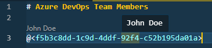
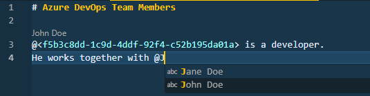

# Azure DevOps Team Members

[](https://github.com/rfverbruggen/azdo-teammembers/actions/workflows/ci.yml)
[](https://sonarcloud.io/summary/new_code?id=rfverbruggen_azdo-teammembers)
[](https://sonarcloud.io/summary/new_code?id=rfverbruggen_azdo-teammembers)

## Features

### Retrieve team members from Azure DevOps

Add you organization URL to the VS Code settings, login using your credentials and the team members will be loaded from Azure DevOps.

```json
{
  "azdo-teammembers.orgUrl": "https://dev.azure.com/[organization]"
}
```

### Code lenses and hovers

The names will be added as CodeLenses above the line where a guid reference is used.

The name will be shown in a hover item when a guid is hovered.



### Autocompletion

An autocomplete will trigger on the `@` sign with the team member names, the guid reference will be inserted.



### Offline: Retrieve team members from your settings

Add your team members to the VS Code settings.

```json
{
  "azdo-teammembers.teammembers": [
    {
      "guid": "f5b3c8dd-1c9d-4ddf-92f4-c52b195da01a",
      "name": "John Doe"
    }
  ]
}
```

## Extension Settings

This extension contributes the following settings:

- `azdo-teammembers.orgUrl`: add the url to your Azure DevOps organisation (e.g. `https://dev.azure.com/[organization]/`)
- `azdo-teammembers.teammembers`: add a list of team members to the extension
- `azdo-teammembers.cache-duration`: the number of seconds the cached objects are valid. Defaults to 24 hours.
